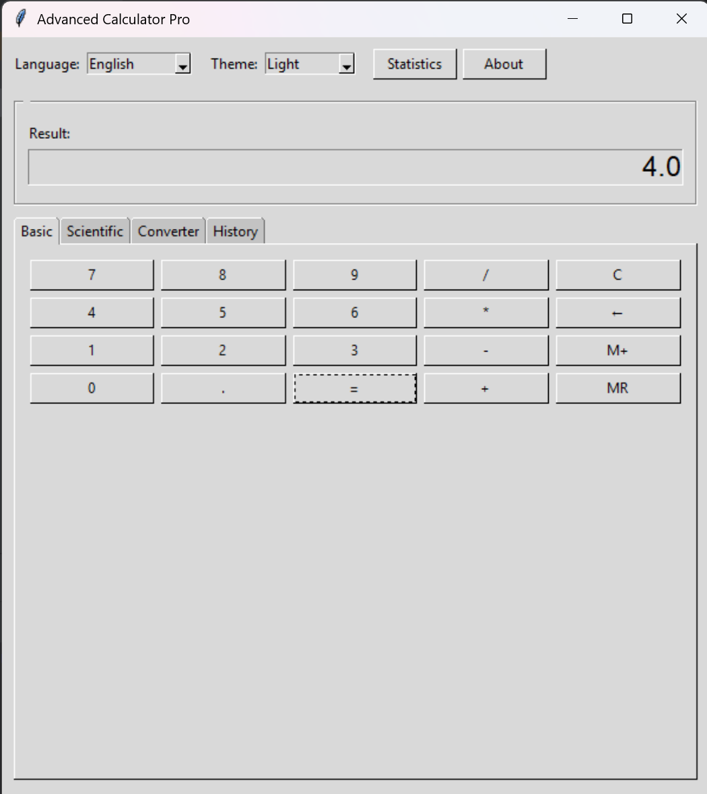
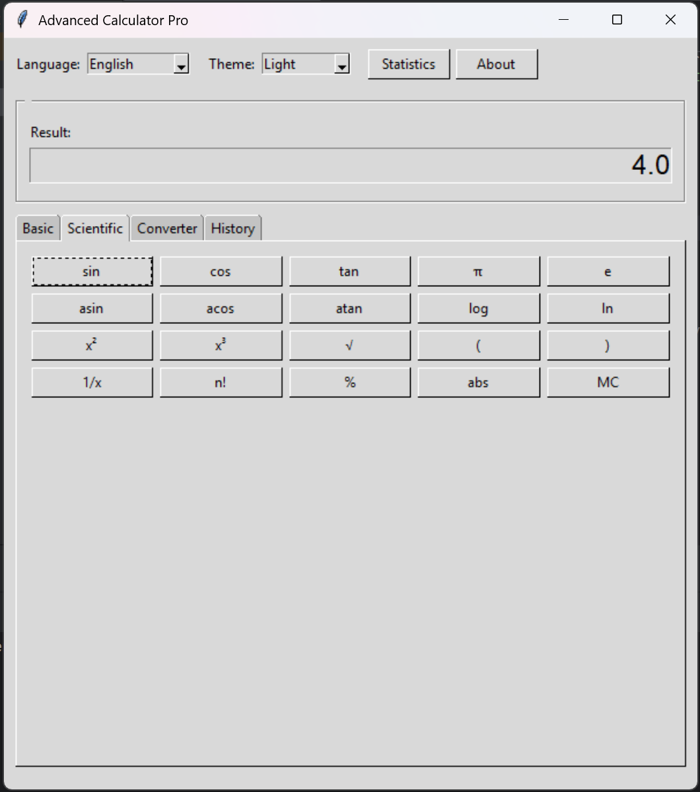

# 🧮 Advanced Calculator Pro

Professional multi-language calculator application demonstrating comprehensive localization practices.


## 🌟 Overview

Advanced Calculator Pro is a desktop application that showcases professional software localization techniques. Built with Python and Tkinter, it features complete support for 5 languages and requires zero external dependencies.

**Key Highlight:** Unlike typical calculator projects, this implementation demonstrates real-world internationalization (i18n) practices with 200+ professional translations and cultural adaptations.

## ✨ Features

### 🧮 Calculator Functionality
- **Basic Operations**: Addition, subtraction, multiplication, division
- **Scientific Functions**: Trigonometric (sin, cos, tan), logarithmic (log, ln), powers, roots
- **Mathematical Constants**: π (pi), e (Euler's number)
- **Advanced Operations**: Factorial, reciprocal, absolute value, percentages

### 🌍 Localization
- **5 Languages**: English, Romanian, Spanish, French, German
- **200+ Translations**: Complete UI localization
- **Diacritics Support**: Perfect rendering (ă, ș, ț, á, é, ñ, ü, etc.)
- **Real-time Switching**: Change language without restart
- **Cultural Adaptation**: Context-appropriate translations

### 🔄 Unit Converter
- **Length**: meters, kilometers, miles, feet, inches
- **Weight**: kilograms, grams, pounds, ounces
- **Temperature**: Celsius, Fahrenheit, Kelvin
- **Currency**: USD, EUR, RON, GBP, JPY

### 📊 Additional Features
- **Persistent History**: Automatic calculation saving
- **Export Functionality**: TXT and CSV formats
- **Memory Functions**: M+, MR, MC operations
- **Usage Statistics**: Track calculations, conversions, errors
- **Visual Themes**: Light and Dark mode
- **Tabbed Interface**: Organized 4-section UI

## 📸 Screenshots

### Main Interface

*Calculator interface with multi-language support*

### Scientific Calculator

*Scientific functions including trigonometry, logarithms, and more*

### Unit Converter

*Convert between length, weight, temperature, and currency units*

### Calculation History

*Persistent history with export functionality*

## 🚀 Quick Start

### Prerequisites
```bash
Python 3.7 or higher (Tkinter included)
```

### Installation

```bash
# Clone the repository
git clone https://github.com/mirunadragunoi/Advanced_Calculator_Pro.git

# Navigate to project directory
cd Advanced_Calculator_Pro

# Run the application
python calculator_app.py
```

## 💻 Usage

### Basic Calculator
```python
# Simple arithmetic
5 + 3 = 8
10 - 4 = 6
7 * 6 = 42
20 / 4 = 5
```

### Scientific Functions
```python
# Trigonometry (angles in radians)
sin(0) = 0
cos(0) = 1
sqrt(16) = 4

# Logarithms
log(10) = 1
ln(e) = 1

# Powers and factorials
5² = 25
5! = 120
```

### Unit Conversion
1. Select conversion type (Length, Weight, Temperature, Currency)
2. Enter value
3. Select source and destination units
4. Click "Convert"

Example:
```
100 cm = 1 m
32°F = 0°C
1 USD = 4.56 RON
```

### Changing Language
Use the **Language** dropdown at the top:
- English
- Română
- Español
- Français
- Deutsch

Interface updates instantly! ⚡

## 🏗️ Project Structure

```
advanced-calculator-pro/
│
├── calculator_app.py          # Main application 
│   ├── Class: AdvancedCalculator
│   ├── Methods: 30+ functions
│   └── Features: 25+ capabilities
│
├── locales/                   # Translation files
│   ├── en/translations.json   # English (40+ keys)
│   ├── ro/translations.json   # Romanian (40+ keys)
│   ├── es/translations.json   # Spanish (40+ keys)
│   ├── fr/translations.json   # French (40+ keys)
│   └── de/translations.json   # German (40+ keys)
│
├── calculator_history.json    # Auto-generated - calculation history
├── calculator_stats.json      # Auto-generated - usage statistics
│
├── docs/                      # Documentation
│   ├── LOCALIZATION_REPORT.md # Detailed localization report
│   └── GITHUB_SETUP_GUIDE.md  # This guide
│
└── README.md                  # You are here
```

## 📊 Technical Details

### Statistics
| Metric | Value |
|--------|-------|
| Lines of Code | 952 |
| Functions/Methods | 30+ |
| Supported Languages | 5 |
| Localizable Strings | 40+ |
| Total Translations | 200+ |
| External Dependencies | 0 |
| Python Version | 3.7+ |

### Technology Stack
- **Language**: Python 3.7+
- **GUI Framework**: Tkinter (built-in)
- **Data Format**: JSON
- **Character Encoding**: UTF-8
- **Architecture**: MVC pattern
- **Localization**: i18n best practices

## 🌍 Localization Approach

This project demonstrates professional localization through:

### 1. Externalized Strings
All translatable text separated from code in JSON files.

### 2. Complete Coverage
Every UI element is localizable:
- Window titles
- Button labels
- Tab names
- Error messages
- Dialog content
- Tooltips

### 3. Cultural Adaptation
Not just word-for-word translation:
- Number formatting considerations
- Date/time format awareness
- Cultural context in messages
- Appropriate formality levels

### 4. Diacritics Support
Perfect rendering of special characters:
- Romanian: ă, â, î, ș, ț
- Spanish: á, é, í, ó, ú, ñ
- French: à, é, è, ê, ç
- German: ä, ö, ü, ß

### 5. Real-time Switching
Change language instantly without restart - a key UX feature.

## 🔧 Adding New Languages

Want to add more languages? It's easy!

**Step 1:** Create language directory
```bash
mkdir -p locales/it  # For Italian
```

**Step 2:** Copy template
```bash
cp locales/en/translations.json locales/it/translations.json
```

**Step 3:** Translate values
```json
{
    "app_title": "Calcolatrice Avanzata Pro",
    "result_label": "Risultato:",
    ...
}
```

**Step 4:** Update code
```python
# In calculator_app.py, line ~XX
languages = ["en", "ro", "es", "fr", "de", "it"]  # Add "it"

# In language selector
values=["English", "Română", "Español", "Français", "Deutsch", "Italiano"]
```

**Step 5:** Test!
```bash
python calculator_app.py
```

## 📄 License

This project is created for educational purposes as part of CIVIS BIP 2024-2025 coursework.

**Subject**: Basis and Methods of Localisation, Translation of Computer Products and Video Games

## 👤 Author

**Drăgunoi Miruna**
- GitHub: [@mirunadragunoi](https://github.com/mirunadragunoi)

## 🎓 Academic Context

This project was developed as the final assignment for:
- **Course**: Basis and Methods of Localisation, Translation of Computer Products and Video Games
- **Program**: CIVIS BIP 2024-2025
- **Professors**: Aranzazu Gil
- **Year**: 2024-2025

### Learning Objectives Met
- ✅ Software internationalization (i18n)
- ✅ Localization (l10n) best practices
- ✅ CAT tools usage (JSON, Python)
- ✅ Multi-language UI design
- ✅ Cultural adaptation
- ✅ Translation management
- ✅ Character encoding handling

## 🙏 Acknowledgments

- **Course Professors** for guidance on localization best practices
- **CIVIS BIP Program** for the international learning opportunity
- **Python Community** for excellent documentation
- **Tkinter** for the robust GUI framework
- **Open Source Community** for inspiration

## 📚 Related Resources

### Localization
- [Python i18n and l10n](https://docs.python.org/3/library/i18n.html)
- [Unicode Standard](https://unicode.org/)
- [GNU gettext](https://www.gnu.org/software/gettext/)

### Python & Tkinter
- [Python Documentation](https://docs.python.org/3/)
- [Tkinter Tutorial](https://docs.python.org/3/library/tkinter.html)
- [Real Python Tkinter](https://realpython.com/python-gui-tkinter/)

## 📈 Project Evolution

### Version 1.0 (Current)
- ✅ Basic and scientific calculator
- ✅ 5 language support
- ✅ Unit converter
- ✅ History and statistics
- ✅ Theme support

### Potential Future Enhancements
- [ ] More languages (Italian, Portuguese, etc.)
- [ ] Graphing calculator features
- [ ] Mobile app version
- [ ] Web version (using Flask/Django)
- [ ] Advanced unit conversions
- [ ] Equation solver
- [ ] Plugins system

---

<div align="center">

**Advanced Calculator Pro** © 2025

Made with ❤️ and Python

[Report Bug](https://github.com/yourusername/advanced-calculator-pro/issues) · 
[Request Feature](https://github.com/yourusername/advanced-calculator-pro/issues) · 
[View Demo](#) · 
[Documentation](docs/)

</div>
